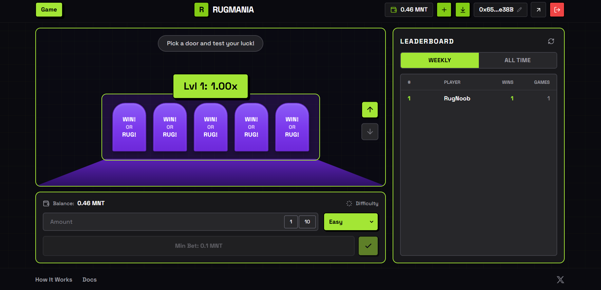
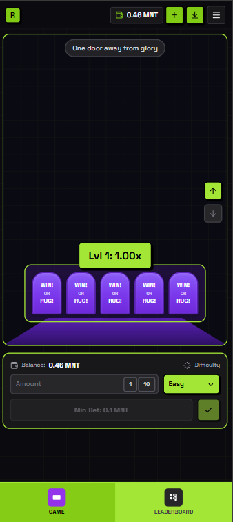
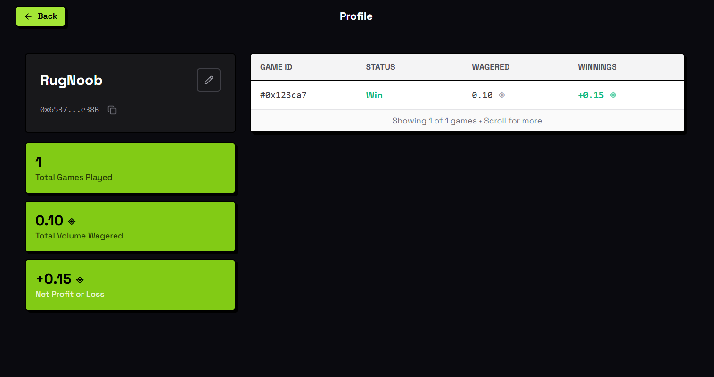

# 🎰 RugMania

### A Provably Fair On-Chain Survival Game on Mantle Network

> **Pick the right door. Multiply your winnings. Don't get rugged.**

---

## 📸 Screenshots

<p align="center">
  
</p>

<p align="center">
  
</p>

<p align="center">
  
</p>

---

## � Thee Problem

Web3 gaming is broken:
- Most games are **not provably fair** — players can't verify outcomes
- Complex wallet setups create **friction** for new users
- Gaming rewards are **unsustainable** — funded by new players (ponzi mechanics)
- No real **DeFi integration** — gaming and yield are separate worlds

---

## 💡 Our Solution: RugMania

RugMania is a **high-stakes survival game** where every outcome is verifiable on-chain, wallets are created instantly, and top players earn **real DeFi yields** from protocol profits.

### How It Works

1. **Connect** — Login with your EVM wallet via Privy
2. **Bet** — Choose your amount and difficulty (3, 4, or 5 doors)
3. **Play** — Pick a door each level. Safe door = advance with higher multiplier. Rug door = game over
4. **Cash Out** — Secure your winnings anytime before the next door

**The twist?** Every game outcome is determined by cryptographic randomness that anyone can verify.

---

## ✨ Key Features

### 🔐 Provably Fair Gaming
Every game uses a **commit-reveal scheme**. The server seed hash is committed before you play, and revealed after — so you can verify the outcome was never manipulated.

### 📱 Seamless User Experience  
No MetaMask popups. No seed phrases. Connect with your EVM wallet and start playing in seconds. Deposit MNT directly in-app.

### 🏆 Competitive Leaderboard
Track your stats, compete for the highest multiplier, and climb the global rankings.

### 💰 Mantle Yield (Coming Soon)
**This is what makes RugMania different.**

A portion of house profits is automatically deployed into Mantle's DeFi ecosystem (Mantle Vault, mETH staking). The yields generated are distributed weekly to **top 10 leaderboard players**.

| Rank | Weekly Yield Share |
|------|-------------------|
| 1st  | 25% |
| 2nd  | 18% |
| 3rd  | 15% |
| 4th-10th | 2-10% |

**Why this matters:**
- Players earn from **protocol success**, not just bets
- Creates **sustainable rewards** without ponzi mechanics
- Drives **TVL to Mantle ecosystem**
- First GameFi on Mantle with native DeFi integration

---

## 🎮 Game Mechanics

### Difficulty Modes

| Mode | Doors | Risk | Level 5 Multiplier | Level 10 Multiplier |
|------|-------|------|-------------------|---------------------|
| Easy | 5 | 20% rug chance | 3.05x | 9.31x |
| Medium | 4 | 25% rug chance | 4.21x | 17.76x |
| Hard | 3 | 33% rug chance | 7.59x | 57.67x |

### House Edge
5% fee on winnings — sustainable economics that fund operations and Mantle Yield pool.

---

## 🏗️ Built With

| Component | Technology |
|-----------|------------|
| Frontend | Next.js, React, TypeScript |
| Styling | Tailwind CSS, Framer Motion |
| Wallet | Privy (EVM Wallet Connection) |
| Blockchain | Wagmi, Viem |
| Network | **Mantle Sepolia Testnet** |
| Smart Contract | Solidity |

---

## 🔗 Deployed Contract

**Mantle Sepolia:** `0x3B909Be5ABD7861028Bf622b04cF205391D52125`

[View on MantleScan →](https://sepolia.mantlescan.xyz/address/0x3B909Be5ABD7861028Bf622b04cF205391D52125)

---

## 🚀 Quick Start

```bash
# Clone the repo
git clone https://github.com/sahilg28/RugMania.git

# Install dependencies
npm install

# Add environment variables
cp .env.example .env.local
# Add your Privy App ID

# Run locally
npm run dev
```

---

## 🎯 Why Mantle?

- **Low Gas Fees** — Micro-bets are economically viable
- **Fast Finality** — Instant game state updates
- **DeFi Ecosystem** — Native integration with Mantle Vault for yield generation
- **EVM Compatible** — Leverage existing Solidity tooling

---

## 👥 Team

**Sahil Gupta** — Full Stack Developer  
**Abhishek Vishwakarma** — Smart Contract & Backend

---

<p align="center">
  <b>Don't get rugged. Cash out smart. 🚪💰</b>
</p>
